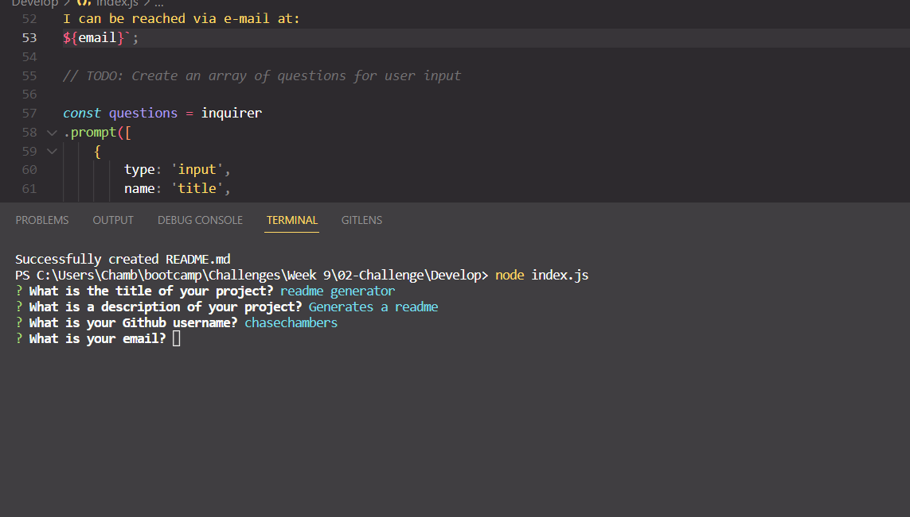

# Read Me Generator
 
 ## Badges

## Description
This project generates a readme based off of user inputs

## Table of Contents
- [Description](#description)
- [Installation](#installation)
- [Usage](#usage)
- [Credits](#credits)
- [License](#license)
- [Badges](#badges)
- [Features](#features)
- [Tests](#tests)
- [Questions](#questions)

## Installation
Install and run through nodejs

## Usage

## Credits
classwork

## License

This project is covered under the MIT License

## Features

## How to Contribute
N/A

## Tests
Changing the inputs to prompts as needed

## Questions
https://github.com/chasechambers

I can be reached via e-mail at:
chambers.chase@gmail.com